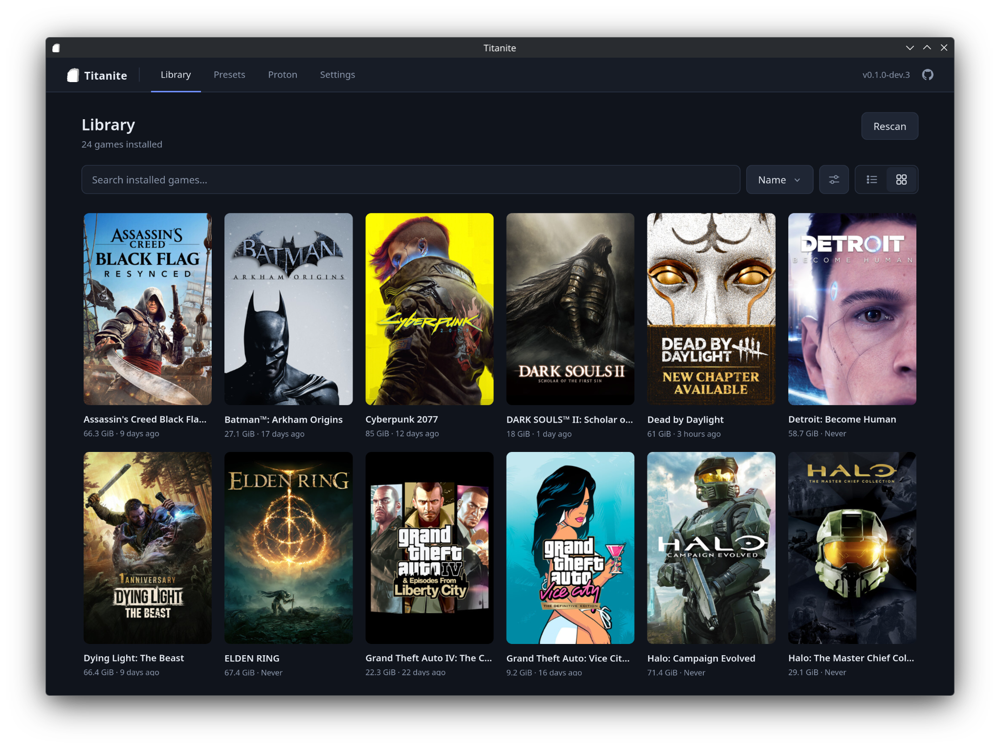
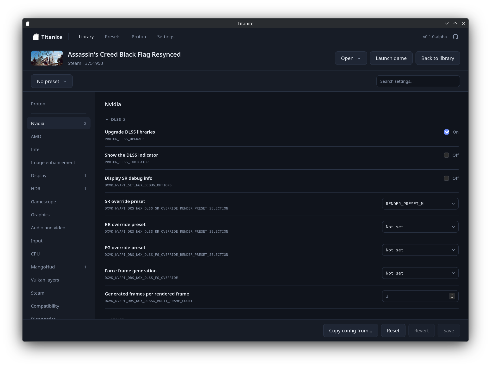

<h1 align="center">
  <br>
  Titanite
</h1>

<p align="center">
  <a href="https://github.com/adds39939/titanite/releases"></a>
  <a href="https://github.com/adds39939/titanite/releases/latest"></a>
  <a href="https://github.com/adds39939/titanite/releases"></a><br>
  <a href="https://github.com/adds39939/titanite/actions/workflows/build.yml"></a>
  
  
  <a href="LICENSE"></a>
</p>

<p align="center">Easy launch argument configuration for your Linux Steam games.</p>

<p align="center">
  
  
</p>

Configure launch arguments for Proton, DXVK, Gamescope, MangoHud, HDR, upscalers and more for any game, all from a real settings page. Save presets and reuse them across games.

## Features

- Easy launch argument configuration for a wide range of game settings, such as Proton, DXVK, VKD3D, Gamescope, MangoHud, HDR, upscalers and GPU-specific options
- Choose the Proton build per game, including custom builds like GE-Proton
- Presets of environment variables and wrapper commands you can apply to any game
- Built-in updates

## How it works

Titanite writes launch options and Proton builds through Steam itself, so changes show up in Steam right away.

Everything Titanite sets ends up as plain launch options in Steam. There are no extra config files, wrapper scripts or background services, and nothing needs to be running when you play. You can see and edit the result in Steam's own properties window, and if you uninstall Titanite your games keep working exactly as you left them.

## Install

Download the latest `.flatpak` from the [releases page](https://github.com/adds39939/titanite/releases), then run:

```sh
flatpak install --user Titanite-*-x86_64.flatpak
```

## Build from source

You'll need the [.NET 10 SDK](https://dotnet.microsoft.com/download/dotnet/10.0). Then build and run:

```sh
dotnet build Titanite.slnx
dotnet run --project src/Titanite.App
```

Run the tests with:

```sh
dotnet test Titanite.slnx
```

## Contributing

Bug reports and feature requests go in [issues](https://github.com/adds39939/titanite/issues). Pull requests are welcome.

## Licence

Titanite is licensed under the [GPL-3.0](LICENSE).
